# Pizzería Don Piccolo - Base de Datos

Este proyecto consiste en el diseño e implementación de una base de datos relacional en MySQL para la **Pizzería Don Piccolo**, permitiendo la gestión eficiente de pedidos, clientes, ingredientes y repartidores.

## Descripción del Proyecto
El sistema fue creado para resolver los problemas de gestión manual de la pizzería, permitiendo un control automatizado desde el registro del pedido hasta la entrega a domicilio, además de calcular ganancias y automatizar el control de stock de los ingredientes.

## Estructura de Tablas y Relaciones
La base de datos contiene las siguientes tablas principales:
- **clientes**: Almacena la información de contacto de los clientes.
- **pizzas**: Catálogo de pizzas disponibles, sus tamaños y precios base.
- **ingredientes**: Inventario de ingredientes para la preparación.
- **pizza_ingredientes**: Tabla intermedia que relaciona qué ingredientes y en qué cantidad componen cada pizza.
- **pedidos**: Registro de cada compra realizada por un cliente.
- **pedido_pizzas**: Detalle de las pizzas solicitadas en cada pedido.
- **repartidores**: Personal de entrega y su estado de disponibilidad.
- **domicilios**: Detalles de cada entrega (hora de salida, entrega, distancia y costo).
- **historial_precios**: Tabla de auditoría alimentada por un trigger para guardar el historial de cambios en el precio de las pizzas.

### Diagrama de Entidad-Relación

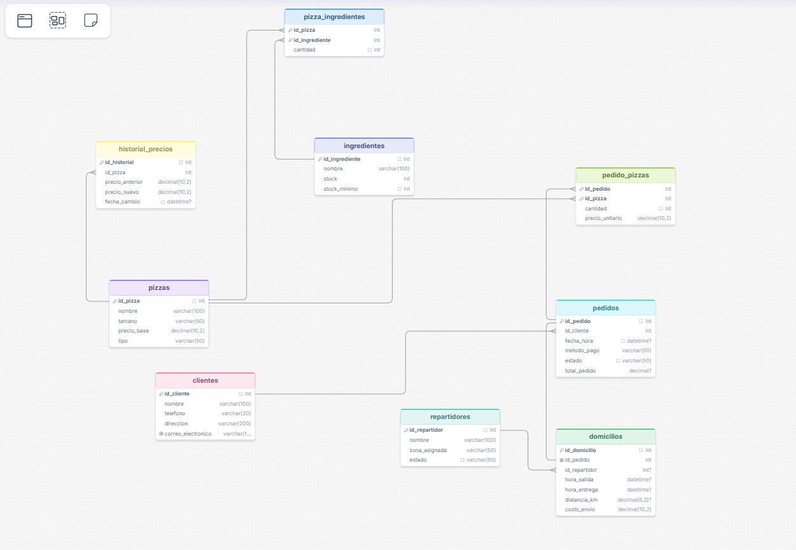

### Explicación de Relaciones
- **Clientes y Pedidos (1:N)**: Un cliente puede realizar múltiples pedidos a lo largo del tiempo, pero cada pedido pertenece a un único cliente.
- **Pizzas e Ingredientes (M:N)**: Una pizza está compuesta por varios ingredientes, y a su vez, un ingrediente puede formar parte de diferentes pizzas. Esta relación de muchos a muchos se resuelve a través de la tabla intermedia `pizza_ingredientes`.
- **Pedidos y Pizzas (M:N)**: Un pedido puede incluir una o varias pizzas, y una pizza puede estar presente en múltiples pedidos. Se resuelve con la tabla intermedia `pedido_pizzas`.
- **Pedidos y Domicilios (1:1)**: Cada pedido para entrega a domicilio tiene asociado un único registro de envío en la tabla `domicilios`.
- **Repartidores y Domicilios (1:N)**: Un repartidor puede realizar múltiples entregas de domicilios, pero cada domicilio es entregado por un solo repartidor.
- **Pizzas e Historial de Precios (1:N)**: Cuando se actualiza el precio de una pizza, el trigger inserta un registro histórico. Una pizza puede tener múltiples cambios registrados en su historial.

## Scripts del Proyecto
- `database.sql`: Creación de la base de datos, tablas y llaves foráneas.
- `funciones.sql`: Funciones para cálculo de totales, ganancias y procedimientos de actualización.
- `triggers.sql`: Triggers de actualización de stock, auditoría y liberación de repartidores.
- `vistas.sql`: Vistas para reportes rápidos (resumen de clientes, desempeño de repartidores, stock crítico).
- `consultas.sql`: Consultas avanzadas requeridas por el negocio (uso de JOIN, HAVING, BETWEEN, subconsultas, etc.).

## Ejemplos de Consultas Requeridas y Resultados

A continuación se presentan las 7 consultas solicitadas, su implementación en SQL, su respectiva captura de pantalla y la explicación de lo que arroja cada una:

### 1. Clientes con pedidos entre dos fechas (BETWEEN)
Obtiene la lista única de clientes que han hecho pedidos dentro de un rango de fechas específico.
```sql
SELECT DISTINCT c.nombre, c.telefono, p.fecha_hora
FROM clientes c
JOIN pedidos p ON c.id_cliente = p.id_cliente
WHERE p.fecha_hora BETWEEN '2023-01-01 00:00:00' AND '2023-12-31 23:59:59';
```
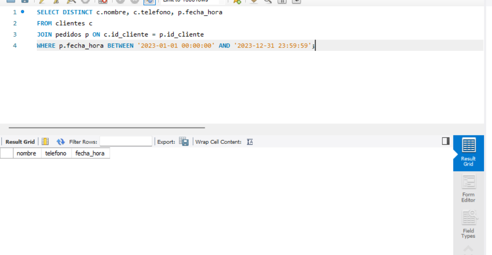
* **Resultado**: Retorna el nombre, teléfono y fecha/hora exacta del pedido para los clientes que realizaron pedidos durante el año 2023.

---

### 2. Pizzas más vendidas (GROUP BY y COUNT/SUM)
Agrupa las pizzas vendidas por su identificador y calcula la cantidad total vendida de cada una.
```sql
SELECT pz.nombre, SUM(pp.cantidad) AS cantidad_vendida
FROM pizzas pz
JOIN pedido_pizzas pp ON pz.id_pizza = pp.id_pizza
GROUP BY pz.id_pizza, pz.nombre
ORDER BY cantidad_vendida DESC;
```
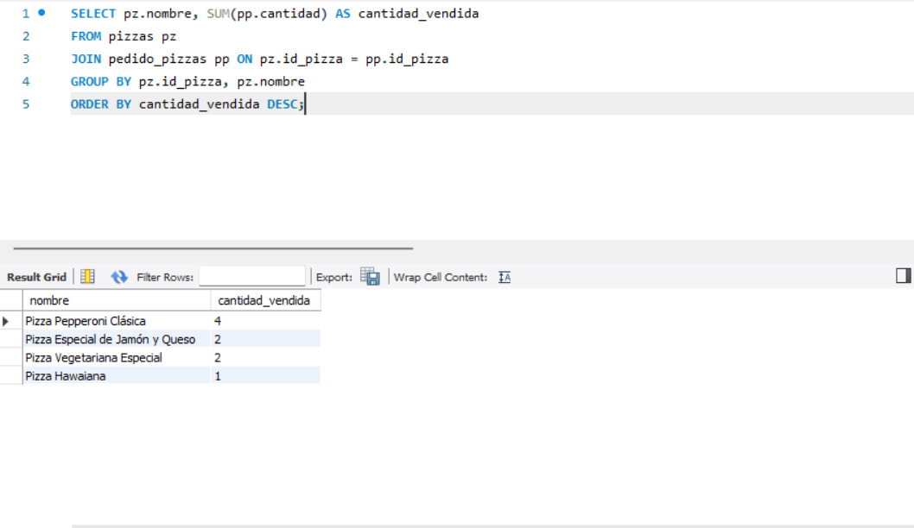
* **Resultado**: Muestra un ranking ordenado de mayor a menor con el nombre de la pizza y la sumatoria total de unidades vendidas.

---

### 3. Pedidos por repartidor (JOIN)
Muestra la lista de pedidos asociados a cada repartidor con el estado actual de la entrega.
```sql
SELECT r.nombre AS repartidor, p.id_pedido, p.estado, d.hora_entrega
FROM repartidores r
JOIN domicilios d ON r.id_repartidor = d.id_repartidor
JOIN pedidos p ON d.id_pedido = p.id_pedido;
```
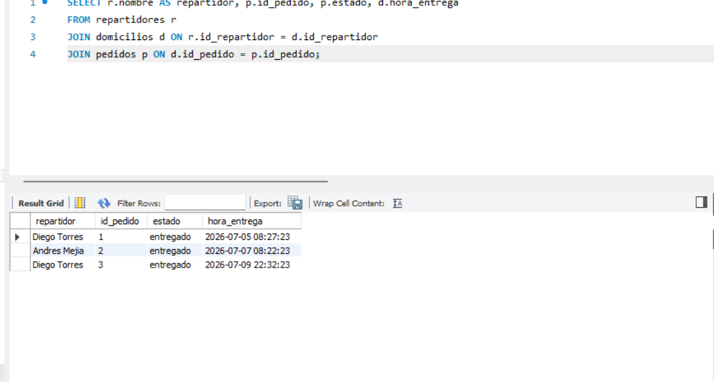
* **Resultado**: Lista el nombre del repartidor junto al ID del pedido asignado, el estado del pedido y la hora en la que fue o será entregado.

---

### 4. Promedio de entrega por zona (AVG y JOIN)
Calcula el tiempo promedio de entrega en minutos agrupado por las diferentes zonas de reparto asignadas.
```sql
SELECT r.zona_asignada, 
       AVG(TIMESTAMPDIFF(MINUTE, d.hora_salida, d.hora_entrega)) AS tiempo_promedio_entrega_minutos
FROM repartidores r
JOIN domicilios d ON r.id_repartidor = d.id_repartidor
WHERE d.hora_entrega IS NOT NULL
GROUP BY r.zona_asignada;
```
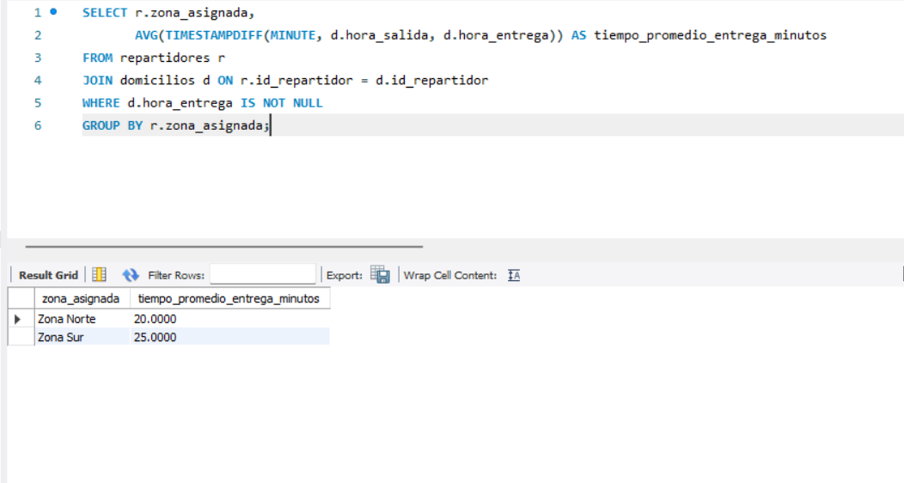
* **Resultado**: Entrega el promedio de tiempo (en minutos) que tardan las entregas desde la salida hasta la entrega efectiva, clasificado por zona geográfica.

---

### 5. Clientes que gastaron más de un monto (HAVING)
Agrupa por cliente, suma su gasto total y filtra aquellos que superaron un monto definido (en este caso, 50,000).
```sql
SELECT c.nombre, SUM(p.total_pedido) AS gasto_total
FROM clientes c
JOIN pedidos p ON c.id_cliente = p.id_cliente
GROUP BY c.id_cliente, c.nombre
HAVING gasto_total > 50000;
```
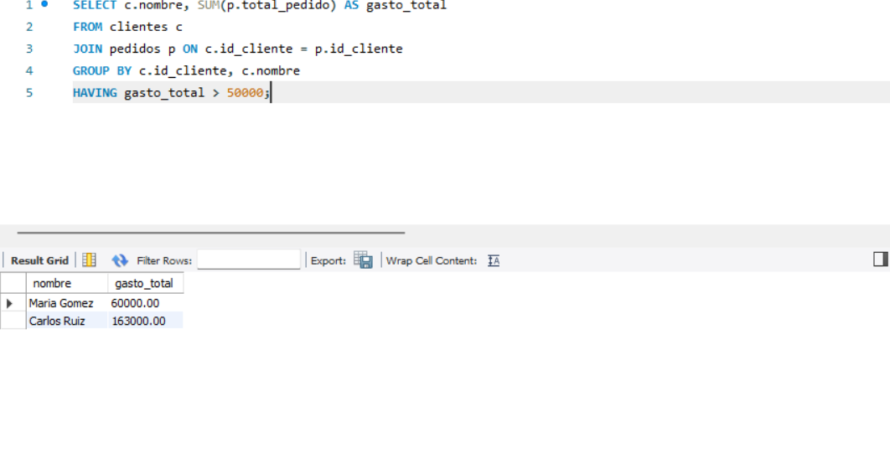
* **Resultado**: Retorna el nombre de los clientes VIP y el acumulado de sus compras, filtrando únicamente a aquellos que han gastado más de 50,000.

---

### 6. Búsqueda por coincidencia parcial de nombre de pizza (LIKE)
Permite buscar pizzas cuyos nombres coincidan parcialmente con un término de búsqueda (en este caso, 'Queso').
```sql
SELECT id_pizza, nombre, tipo, precio_base
FROM pizzas
WHERE nombre LIKE '%Queso%';
```
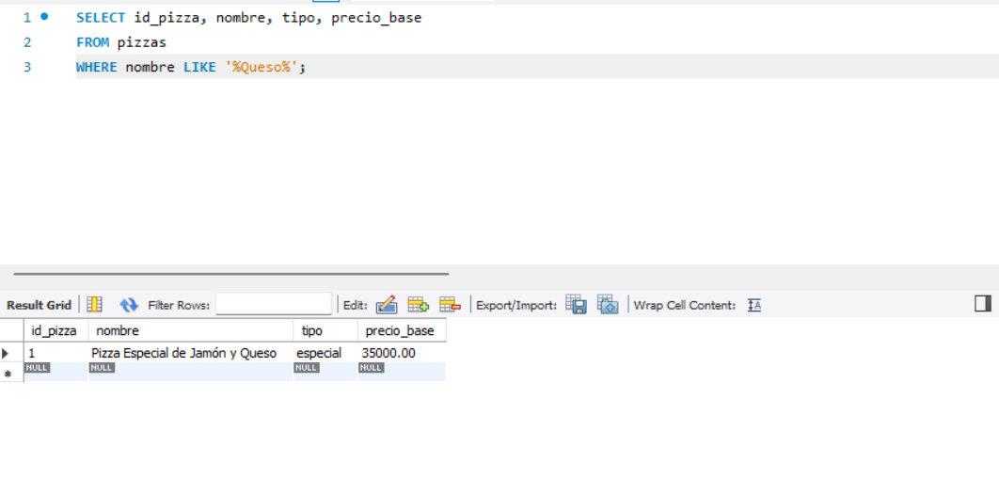
* **Resultado**: Devuelve la información de las pizzas que contienen la palabra "Queso" en cualquier parte de su nombre.

---

### 7. Subconsulta para obtener los clientes frecuentes (más de 5 pedidos mensuales)
Identifica los clientes que han registrado más de 5 pedidos a través de una subconsulta.
```sql
SELECT nombre, telefono, correo_electronico
FROM clientes
WHERE id_cliente IN (
    SELECT id_cliente
    FROM pedidos
    GROUP BY id_cliente
    HAVING COUNT(id_pedido) > 5
);
```
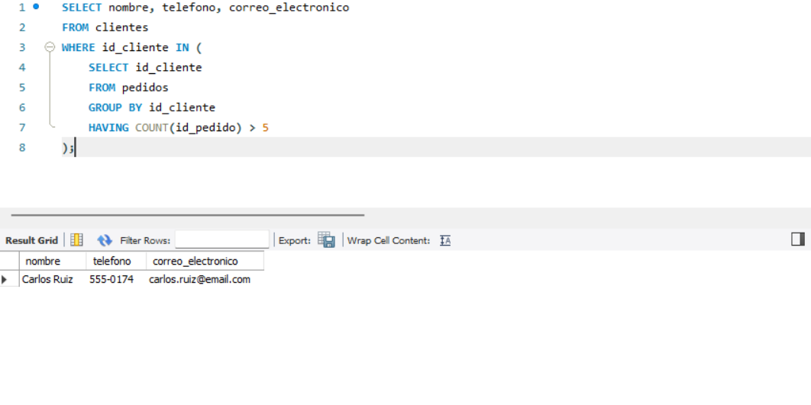
* **Resultado**: Retorna los datos de contacto de aquellos clientes frecuentes que registran un volumen superior a 5 pedidos en el sistema.

---

## Pruebas de Funciones, Triggers y Vistas

A continuación se presentan las evidencias de las pruebas unitarias realizadas para verificar el correcto funcionamiento de las funciones, triggers y vistas:

### Prueba 1: Creación de Base de Datos y Tablas
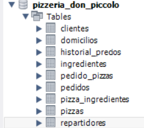
* **Descripción**: Muestra la ejecución de `database.sql`, creando la estructura relacional sin errores.

### Prueba 2: Función `calcular_total_pedido`
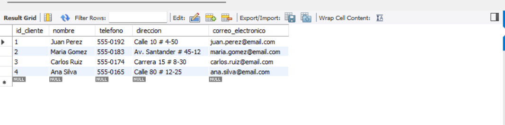
* **Descripción**: Verifica el cálculo del total de un pedido sumando el precio de las pizzas, el costo del envío e incorporando la tasa de IVA.

### Prueba 3: Función `calcular_ganancia_diaria`
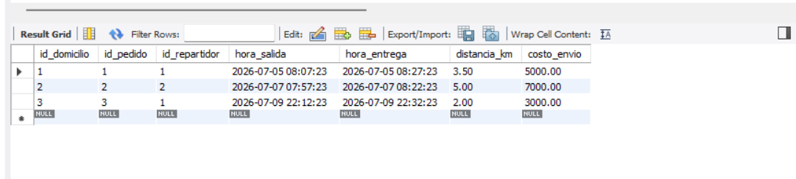
* **Descripción**: Ejecución de la función que calcula las ganancias netas de un día deduciendo los costos de insumos estimulados de las ventas totales.

### Prueba 4: Procedimiento `registrar_entrega_pedido`
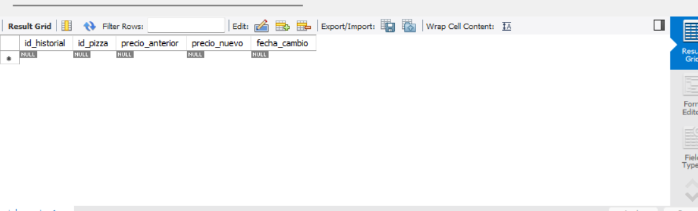
* **Descripción**: Demuestra la ejecución del procedimiento para actualizar la hora de entrega, lo cual desencadena el cambio de estado del pedido a 'entregado'.

### Prueba 5: Trigger `tr_actualizar_stock_ingredientes`
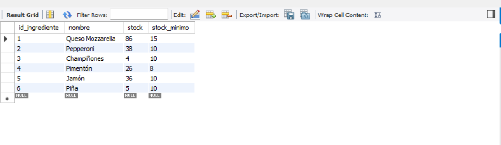
* **Descripción**: Muestra el decremento automático del stock de los ingredientes cada vez que ingresa una nueva pizza en un pedido.

### Prueba 6: Trigger `tr_auditoria_precio_pizza`
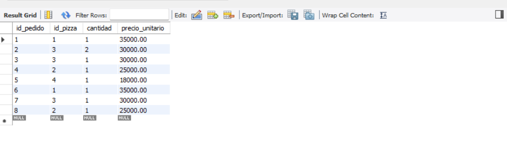
* **Descripción**: Evidencia cómo el trigger registra en la tabla `historial_precios` el valor anterior y nuevo tras actualizar el precio de una pizza.

### Prueba 7: Trigger `tr_liberar_repartidor`
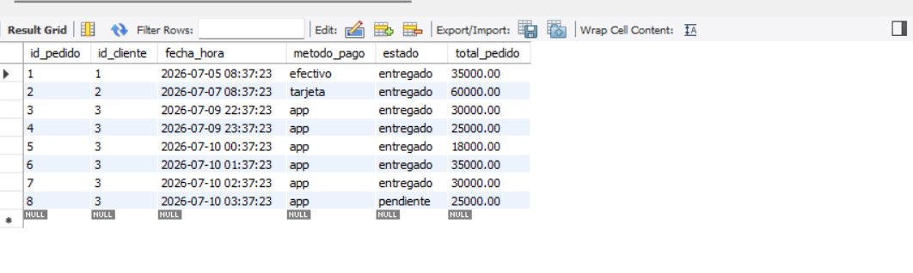
* **Descripción**: Muestra cómo el estado del repartidor cambia automáticamente a 'disponible' cuando se asienta la hora de entrega del domicilio.

### Prueba 8: Vista `vista_resumen_clientes`
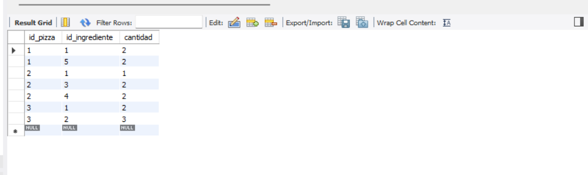
* **Descripción**: Consulta a la vista que resume la cantidad de pedidos y el total acumulado por cada cliente.

### Prueba 9: Vista `vista_desempeno_repartidores`
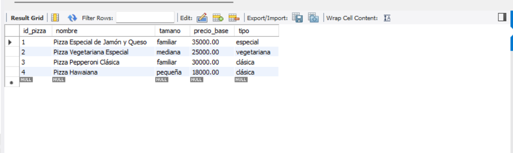
* **Descripción**: Consulta a la vista que consolida las métricas de rendimiento de cada repartidor (entregas totales y su tiempo promedio en minutos).

### Prueba 10: Vista `vista_stock_critico`
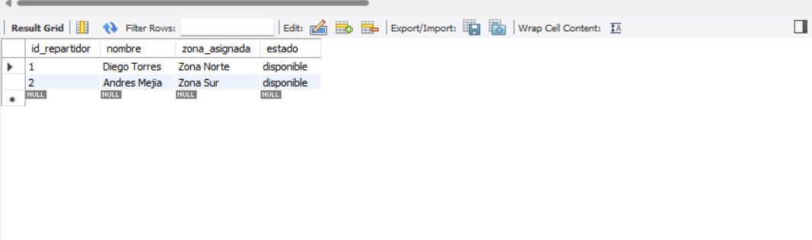
* **Descripción**: Muestra los insumos cuyo stock disponible es menor a su límite mínimo permitido.

---

## Instrucciones para ejecutar el script
1. Abre tu cliente de base de datos preferido (MySQL Workbench, DBeaver, o consola de MySQL).
2. Conéctate a tu servidor MySQL.
3. Ejecuta los scripts en el siguiente orden para evitar problemas de dependencias:
   - `database.sql`
   - `funciones.sql`
   - `triggers.sql`
   - `vistas.sql`
   - `datos_prueba.sql` (para poblar la base de datos con información de pruebas)
   - `consultas.sql` (para probar el comportamiento de las consultas)
